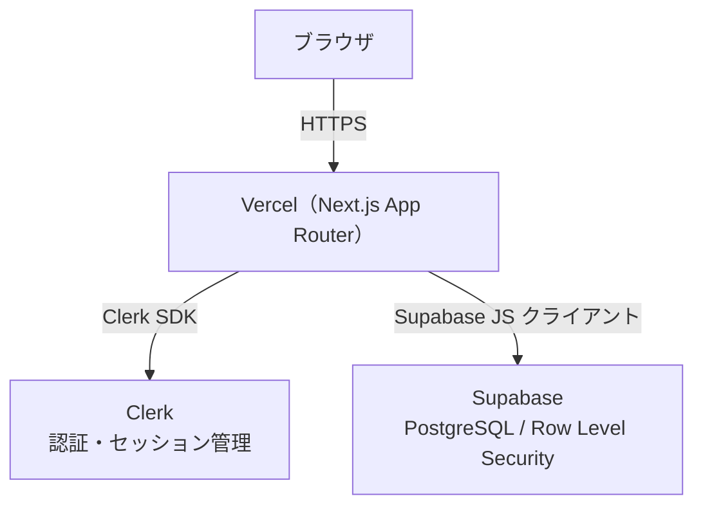

# アーキテクチャ設計

---

## 技術スタック

| 区分 | 技術 | 採用理由 |
|------|------|---------|
| フレームワーク | Next.js 15（App Router）+ TypeScript | React Server Components によるパフォーマンス、型安全性 |
| スタイリング | Tailwind CSS | ユーティリティファーストで開発速度が高い |
| 認証 | Clerk（Free Tier） | UIコンポーネント込みで認証を迅速に実装できる |
| データベース | Supabase PostgreSQL（Free Tier） | RLS によるDBレベルのセキュリティ、リアルタイム対応 |
| フォーム | React Hook Form + Zod | パフォーマンスとバリデーションの分離 |
| デプロイ | Vercel | Next.js との親和性が高く、設定レスでデプロイ可能 |

> 開発環境・テスト・CI/CD の構成は [10_development-environment.md](../development/10_development-environment.md) を参照。
> コーディング規約・Linter/Formatter・コード品質診断ツールは [08_coding-standards.md](../development/08_coding-standards.md) を参照。

---

## システム構成



### データフローの概要

1. ユーザーが Clerk でログイン → Clerk がセッションを管理し JWT（有効期限 60 秒）を発行
2. Server Component / Server Action が Clerk SDK でユーザー情報を取得
3. `auth().getToken()` で取得した Clerk JWT を Authorization ヘッダーに付与して Supabase にリクエスト
4. Supabase が Clerk の JWKS エンドポイントで JWT を検証し、RLS ポリシーを評価
5. RLS が通過したデータのみ返却

---

## 認証・認可設計

### 認証：Clerk

- ログイン・ログアウト・セッション管理はすべて Clerk に委譲する
- セッションの長命管理は Clerk の Cookie（`__client`）が担う
- アプリ側でパスワードや認証情報を直接扱わない

### 認可：Supabase Row Level Security（RLS）

**連携方式：Third-party Auth（Clerk ネイティブ統合）**

JWT テンプレート方式は 2025 年 4 月に廃止済み。現在の公式推奨は Third-party Auth。

#### 設定概要

| 設定場所 | 内容 |
|---------|------|
| Clerk ダッシュボード | Integrations → Supabase を有効化 |
| Supabase ダッシュボード | Authentication → Third-party providers → Clerk を追加 |
| ローカル開発 | `supabase/config.toml` に Clerk ドメインを設定 |

#### 仕組み

Supabase が Clerk の JWKS エンドポイント（`https://api.clerk.com/v1/jwks`）から公開鍵を取得し、受け取った JWT の署名を検証する。秘密鍵は Clerk だけが保持するため、JWT の偽造は不可能。

#### RLS ポリシーの記述方針

Clerk のユーザー ID は UUID 形式ではなく文字列（例：`user_2abc123`）であるため、以下の点に注意する。

```sql
-- ✅ 正しい書き方
-- user_id カラムは TEXT 型で定義する
-- auth.uid() ではなく auth.jwt()->>'sub' を使う
-- サブクエリでラップしてパフォーマンスを最適化する

CREATE POLICY "自分の記録のみ参照可能"
ON records FOR SELECT
TO authenticated
USING ((SELECT auth.jwt()->>'sub') = user_id);

-- ❌ 誤った書き方（Clerk ID は UUID でないためキャストエラーになる）
USING (auth.uid() = user_id);
```

---

## ディレクトリ構成

### 方針

- **App Router の `app/` ディレクトリはルーティング専用**として扱う
- ビジネスロジック・コンポーネントはルートに**コロケーション（同居）**する
- プライベートフォルダ（`_` prefix）を使い、ルーティングに影響させない
- **MVP 以降で機能が増えた時点で `src/features/` に抽出**する（現時点では不要）

### ディレクトリツリー

```
cbt/
├── src/
│   ├── app/                              # Next.js App Router（ルーティング専用）
│   │   ├── (auth)/                       # 認証系ページ（URL に影響しない）
│   │   │   ├── sign-in/
│   │   │   │   └── [[...sign-in]]/
│   │   │   │       └── page.tsx
│   │   │   └── sign-up/
│   │   │       └── [[...sign-up]]/
│   │   │           └── page.tsx
│   │   │
│   │   ├── records/                      # 思考記録（コア機能）
│   │   │   ├── page.tsx                  # 一覧
│   │   │   ├── _components/              # この画面専用コンポーネント
│   │   │   │   └── RecordList.tsx
│   │   │   ├── new/
│   │   │   │   ├── page.tsx              # 新規作成
│   │   │   │   ├── _components/
│   │   │   │   │   └── RecordForm.tsx
│   │   │   │   └── _actions/
│   │   │   │       └── create-record.ts  # Server Action
│   │   │   └── [id]/
│   │   │       ├── page.tsx              # 詳細
│   │   │       ├── edit/
│   │   │       │   ├── page.tsx          # 編集
│   │   │       │   ├── _components/
│   │   │       │   │   └── EditForm.tsx
│   │   │       │   └── _actions/
│   │   │       │       └── update-record.ts
│   │   │       └── _actions/
│   │   │           └── delete-record.ts
│   │   │
│   │   ├── layout.tsx                    # Root Layout（Clerk Provider）
│   │   ├── page.tsx                      # トップページ（ダッシュボード）
│   │   └── globals.css
│   │
│   ├── components/                       # アプリ全体で使う共有コンポーネント
│   │   ├── ui/                           # 汎用UIプリミティブ（ドメイン知識ゼロ）
│   │   │   ├── Button.tsx
│   │   │   ├── Input.tsx
│   │   │   ├── Textarea.tsx
│   │   │   └── Card.tsx
│   │   └── layout/                       # 共通レイアウト部品
│   │       ├── Header.tsx
│   │       └── Footer.tsx
│   │
│   ├── lib/                              # 外部サービスのクライアント設定
│   │   ├── supabase.ts                   # Supabase クライアント（Third-party Auth 設定済み）
│   │   └── supabase-admin.ts             # Service Role クライアント（管理操作専用）
│   │
│   ├── types/                            # アプリ全体の共有型
│   │   └── database.types.ts             # Supabase CLI で自動生成
│   │
│   └── utils/                            # 汎用ユーティリティ
│       └── cn.ts                         # className マージユーティリティ
│
├── supabase/                             # Supabase ローカル開発設定
│   ├── config.toml
│   └── migrations/                       # DB マイグレーションファイル
│
├── public/
├── next.config.ts
├── tailwind.config.ts
└── tsconfig.json
```

### コンポーネントの分類基準

| 置き場所 | 基準 | 例 |
|---------|------|-----|
| `app/**/_components/` | そのルートページだけで使う | `RecordForm`, `RecordList` |
| `components/ui/` | どのドメインでも使える汎用部品 | `Button`, `Input`, `Card` |
| `components/layout/` | アプリ全体で共有するレイアウト | `Header`, `Footer` |

### Server Actions の配置基準

| 置き場所 | 基準 |
|---------|------|
| `app/**/_actions/` | そのルートからのみ呼ばれる操作 |

Server Actions はビジネスロジックの薄いラッパーに留める。DB への直接クエリは `lib/supabase.ts` に切り出し、テスト可能な形を保つ。

### `features/` への抽出タイミング

以下のいずれかになった時点で `src/features/` を設ける：

- 同じロジック・コンポーネントを **2つ以上のルートが共有**するようになった
- **Phase 2 以降の機能追加**（タグ、インサイト、AI等）でドメインが明確に分かれた

### Server / Client Component の判断基準

`use client` の配置ミスはバンドルサイズ増加・データ漏洩・レンダリングエラーの原因になる。以下の基準に従って判断する。

| 条件 | 選択 |
|------|------|
| DB アクセス・Supabase クエリを含む | Server Component |
| Clerk `auth()` でユーザー情報を取得する | Server Component |
| 環境変数（サーバー専用）を参照する | Server Component |
| `useState` / `useEffect` / イベントハンドラを使う | Client Component |
| `window` / `localStorage` など ブラウザ API を使う | Client Component |
| React Hook Form などフォームライブラリを使う | Client Component |

**原則：`use client` はツリーの末端（葉コンポーネント）に押し下げる。**

```
// ✅ Server Component が Client Component を子として受け取る（OK）
// app/records/page.tsx（Server）
export default async function RecordsPage() {
  const records = await fetchRecords()
  return <RecordList records={records} />  // RecordList は Client でも可
}

// ❌ Client Component の中で Server Component を直接 import する（NG）
// 'use client'
// import ServerOnlyComponent from './ServerOnly'  // ← エラーになる
```

---

## データフェッチ・更新の設計

### 基本方針

| 操作 | 方法 | 場所 |
|------|------|------|
| データ取得（読み取り） | Server Component 内で直接 `await` | `app/**/page.tsx` |
| データ更新（書き込み） | Server Actions | `app/**/_actions/*.ts` |
| クライアントサイドの状態 | React Hook Form（フォーム）/ useState | `_components/` 内 |

```typescript
// ✅ データ取得の例（Server Component）
// app/records/page.tsx
import { createServerSupabaseClient } from '@/lib/supabase'
import { auth } from '@clerk/nextjs/server'

export default async function RecordsPage() {
  const { userId } = await auth()
  if (!userId) redirect('/sign-in')

  const supabase = await createServerSupabaseClient()
  const { data: records } = await supabase
    .from('records')
    .select('*')
    .order('created_at', { ascending: false })
    .limit(20)

  return <RecordList records={records ?? []} />
}
```

```typescript
// ✅ Server Action の例
// app/records/new/_actions/create-record.ts
'use server'
import { createServerSupabaseClient } from '@/lib/supabase'
import { revalidatePath } from 'next/cache'

export async function createRecord(input: CreateRecordInput) {
  const supabase = await createServerSupabaseClient()
  const { error } = await supabase.from('records').insert(input)
  if (error) throw error
  revalidatePath('/records')
}
```

### Supabase クライアントの初期化

```typescript
// src/lib/supabase.ts
import { createClient } from '@supabase/supabase-js'
import { auth } from '@clerk/nextjs/server'

export async function createServerSupabaseClient() {
  return createClient(
    process.env.NEXT_PUBLIC_SUPABASE_URL!,
    process.env.NEXT_PUBLIC_SUPABASE_ANON_KEY!,
    {
      accessToken: async () => (await auth()).getToken(),
    }
  )
}
```

---

## キャッシング戦略

### Next.js のキャッシュレイヤー

Next.js App Router は複数のキャッシュレイヤーを持つ。意図しないキャッシュが本番バグの原因になりやすいため、方針を明文化する。

| レイヤー | 場所 | 無効化方法 |
|---------|------|----------|
| Full Route Cache | Vercel エッジ（サーバー） | `revalidatePath()` / `revalidateTag()` |
| Data Cache | サーバー（fetch 単位） | `fetch` オプション / `revalidateTag()` |
| Router Cache | ブラウザ（クライアント） | ページ遷移・`router.refresh()` |

### このプロジェクトの方針

| データ種別 | キャッシュ方針 | 理由 |
|-----------|-------------|------|
| 思考記録（records） | **キャッシュしない**（`no-store` 相当） | ユーザー固有データ。RLS が適用されるため静的キャッシュは不適切 |
| Supabase クライアント経由のクエリ | キャッシュなし（Supabase JS は `fetch` の Data Cache を使わない） | Supabase JS の内部実装が `fetch` を直接使わないため |
| Server Actions 後のデータ更新 | `revalidatePath('/records')` で明示的に無効化 | 作成・更新・削除後に一覧を最新化する |

```typescript
// ✅ Server Action 後の再検証
'use server'
import { revalidatePath } from 'next/cache'

export async function createRecord(input: CreateRecordInput) {
  const supabase = await createServerSupabaseClient()
  const { error } = await supabase.from('records').insert(input)
  if (error) throw error
  revalidatePath('/records')  // 一覧ページのキャッシュを無効化
}
```

---

## エラーハンドリング方針

### ファイルシステムレベルの役割分担

App Router はファイル名による特殊なエラーハンドリングを提供する。

| ファイル | 役割 | 配置例 |
|---------|------|-------|
| `error.tsx` | Route Segment のエラーバウンダリ（予期せぬサーバーエラー） | `app/records/error.tsx` |
| `not-found.tsx` | `notFound()` を呼んだ場合の 404 表示 | `app/records/[id]/not-found.tsx` |
| `loading.tsx` | Suspense の fallback（データフェッチ中のスケルトン） | `app/records/loading.tsx` |
| `global-error.tsx` | Root Layout レベルの致命的エラー | `app/global-error.tsx` |

### Server Actions のエラー戻り値設計

Server Actions 内で `throw` したエラーは Client Component に正しく伝播しない場合がある。戻り値でエラーを返す Result パターンを使う。

```typescript
// ✅ Result パターン（推奨）
export async function createRecord(
  input: CreateRecordInput
): Promise<{ error?: string }> {
  const supabase = await createServerSupabaseClient()
  const { error } = await supabase.from('records').insert(input)
  if (error) return { error: '保存に失敗しました。もう一度お試しください。' }
  revalidatePath('/records')
  return {}
}

// Client Component 側
const { error } = await createRecord(input)
if (error) setErrorMessage(error)
```

### バリデーションエラーの扱い

Zod によるバリデーションエラーは Server Actions 内で処理し、フィールド別のエラーメッセージを返す。React Hook Form の `setError` と組み合わせて使う。

```typescript
// Server Action でバリデーション
const result = CreateRecordSchema.safeParse(input)
if (!result.success) {
  return { fieldErrors: result.error.flatten().fieldErrors }
}
```

---

## 環境変数

| 変数名 | 用途 | 公開範囲 |
|-------|------|---------|
| `NEXT_PUBLIC_SUPABASE_URL` | Supabase プロジェクト URL | クライアント可 |
| `NEXT_PUBLIC_SUPABASE_ANON_KEY` | Supabase 匿名キー | クライアント可 |
| `SUPABASE_SERVICE_ROLE_KEY` | RLS バイパス（管理操作専用） | サーバーのみ |
| `NEXT_PUBLIC_CLERK_PUBLISHABLE_KEY` | Clerk 公開鍵 | クライアント可 |
| `CLERK_SECRET_KEY` | Clerk 秘密鍵 | サーバーのみ |

> `SUPABASE_SERVICE_ROLE_KEY` と `CLERK_SECRET_KEY` は `.env.local` に保存し、絶対にクライアントサイドに渡さない。

---

## セキュリティ方針

| 項目 | 方針 |
|------|------|
| 認証 | Clerk に委譲。パスワード・認証情報を直接扱わない |
| 認可 | Supabase RLS（Third-party Auth）でDBレベルで担保 |
| XSS | Next.js のデフォルトエスケープに準拠。`dangerouslySetInnerHTML` は使わない |
| SQLインジェクション | Supabase JS クライアントのパラメータ化クエリを使用 |
| 機密情報 | サーバー専用環境変数に格納。コミットしない（`.gitignore` で除外） |
| 医療的免責 | フッターに「本アプリは医療行為・診断を行うものではありません」を表示 |

---

## アーキテクチャ決定記録（ADR）

> 重要な技術選定の判断根拠を記録する。「なぜその選択肢を選んだか」だけでなく「なぜ他を選ばなかったか」も残す。

### ADR-001: 認証に Clerk を採用する

| 項目 | 内容 |
|------|------|
| 状態 | 採用済み |
| 決定日 | 2026-02 |

**背景：** ユーザー認証が必要だが、認証機能の実装・運用に時間をかけずポートフォリオのコア機能に集中したい。

**検討した選択肢：**

| 選択肢 | 却下理由 |
|-------|---------|
| NextAuth.js（Auth.js） | セッション管理・プロバイダー設定を自前で実装する量が多い。Free Tier での運用も考えると Clerk の方が管理コストが低い |
| Supabase Auth | Supabase に認証も一元化できるが、Clerk の UI コンポーネント（サインイン画面）が実装工数を大きく削減できる |
| Firebase Authentication | Google エコシステムへの依存が増える。Supabase との組み合わせで RLS 連携の設定が複雑になる |

**決定：** Clerk を採用。UI コンポーネント込みで認証画面の実装が不要になる点と、Supabase との Third-party Auth 統合（公式サポート）が充実している点を評価した。

---

### ADR-002: Supabase RLS の連携に Third-party Auth を採用する

| 項目 | 内容 |
|------|------|
| 状態 | 採用済み |
| 決定日 | 2026-02 |

**背景：** Supabase の RLS を正しく動作させるために、Clerk の認証情報を Supabase に伝える方法を選定する必要がある。

**検討した選択肢：**

| 選択肢 | 却下理由 |
|-------|---------|
| JWT テンプレート方式 | 2025 年 4 月に公式非推奨（Deprecated）。Supabase の JWT シークレットを Clerk と共有する必要があり、セキュリティリスクがある |
| Service Role キー方式（RLS バイパス） | DB レベルのセキュリティが効かない。コードバグが即データ漏洩につながるリスクがある |

**決定：** Third-party Auth（Clerk ネイティブ統合）を採用。RS256 + JWKS 検証により JWT 偽造が不可能で、秘密鍵の共有も不要。公式推奨かつ設定コストが低い。

**注意点：** Clerk の userId は UUID 形式でないため `auth.uid()` は使えない。RLS ポリシーでは `auth.jwt()->>'sub'` を使い、`user_id` カラムは `TEXT` 型で定義する。

---

### ADR-003: ディレクトリ構成に App Router コロケーション方式を採用する

| 項目 | 内容 |
|------|------|
| 状態 | 採用済み（MVP フェーズ） |
| 決定日 | 2026-02 |

**背景：** Next.js App Router プロジェクトのディレクトリ設計を決定する。将来 30 ページ・17 テーブル規模への成長が見込まれる。

**検討した選択肢：**

| 選択肢 | 却下理由 |
|-------|---------|
| `src/features/` 中心の feature-based（Bulletproof-React 型） | MVP フェーズはページ数が少なく、`features/` の恩恵（再利用・並行開発）が出ない。早期から導入するとオーバーエンジニアリング |
| Feature-Sliced Design（FSD） | ソロ開発・MVP には過剰。学習コストが高く、小規模プロジェクトではファイル数が無駄に増える |

**決定：** `app/` 内コロケーション方式（`_components/`・`_actions/` プライベートフォルダ）を MVP フェーズで採用。Phase 2 以降で同一ロジックを複数ルートが共有するようになった時点で `src/features/` へ抽出する。

---

### ADR-004: FE/BE 間の Contract に TypeScript 型 + Zod スキーマを採用する

| 項目 | 内容 |
|------|------|
| 状態 | 採用済み |
| 決定日 | 2026-02 |

**背景：** このプロジェクトは REST API を持たず、Server Actions でフロントエンドとバックエンドが直接通信する。両者の入出力の形を誰が・何が定義するかを明文化する必要がある。

**検討した選択肢：**

| 選択肢 | 却下理由 |
|-------|---------|
| OpenAPI（REST API 仕様書） | Server Actions は HTTP エンドポイントではないため適用できない |
| コメント・ドキュメントのみ | 実装との乖離が起きてもコンパイラが検知できない |
| GraphQL スキーマ | 導入コストが高く、MVP 規模では過剰 |

**決定：** TypeScript 型定義と Zod スキーマを FE/BE 間の Contract として使用する。

- **Zod スキーマ**：Server Action が受け取る入力の形・バリデーションルールを定義する唯一の情報源
- **`z.infer<typeof Schema>`**：スキーマから TypeScript 型を導出することで、手書きの型定義との二重管理を排除する
- **Contract の置き場**：機能仕様書（`docs/features/<feature>/spec.md`）の「データ型・Contract」セクションに記述し、実装前にレビュー可能にする

```typescript
// Contract の例（spec.md に記述 → 実装時にそのまま使う）
const CreateRecordSchema = z.object({
  situation: z.string().optional(),
  thought:   z.string().optional(),
  emotion:   z.string().optional(),
}).refine(
  (d) => d.situation || d.thought || d.emotion,
  { message: '1つ以上入力してください' }
)
type CreateRecordInput = z.infer<typeof CreateRecordSchema>
```

> Contract 先行設計の開発フロー（spec.md を先に書いてから実装する手順）は [07_development-phases.md — Phase 3](../development/07_development-phases.md) を参照。

---

### ADR-005: ESLint 設定構成を Airbnb から Next 公式 + TypeScript strict に変更する

| 項目 | 内容 |
|------|------|
| 状態 | 採用済み |
| 決定日 | 2026-03 |

**背景：** 当初 Airbnb スタイルガイドをベースにした ESLint 設定を予定していたが、プロジェクトの実態に合わないため構成を見直す。Next.js 15 + TypeScript + Prettier の技術スタックに最適な ESLint 設定を選定する必要がある。

**検討した選択肢：**

| 選択肢 | 却下理由 |
|-------|---------|
| Airbnb スタイルガイド（`eslint-config-airbnb`） | Next.js 15 の Flat Config との互換性に問題がある。React / TypeScript 関連ルールが Next.js 公式設定と重複・競合する。独自の厳格なルールがプロジェクトの開発速度を不必要に低下させる |
| `eslint-config-next` のみ（最小構成） | Next.js 固有ルールと React の基本ルールしか含まず、TypeScript の品質チェックが不十分。Core Web Vitals ルールも warning 止まり |
| `strict-type-checked`（型チェック付き最厳格） | `tsconfig.json` との連携が必要でビルド時間が増加する。MVP フェーズでは過剰 |

**決定：** 以下の 4 層構成を採用する。

1. **`eslint-config-next/core-web-vitals`** — Next.js 固有ルール + React + Core Web Vitals（基盤）
2. **`eslint-config-next/typescript`** — `typescript-eslint/recommended`（Next.js 同梱）
3. **`typescript-eslint` strict 設定** — `recommended` → `strict` に引き上げ。型チェック不要で品質向上
4. **`eslint-config-prettier`** — Prettier との競合ルール無効化

**不採用としたプラグイン：**

| プラグイン | 理由 |
|-----------|------|
| `eslint-plugin-import` | Next.js 15 の Flat Config + パスエイリアス（`@/`）との組み合わせでトラブル報告多数。安定するまで見送り |
| `eslint-plugin-unicorn` | 汎用ベストプラクティスの強制は有用だが、ソロ開発の MVP フェーズでは過剰。Phase 2 以降で必要に応じて追加 |
| `eslint-plugin-tailwindcss` | Tailwind v4 では Prettier プラグインでクラス順序を管理する方が主流 |

**将来の拡張ポイント：**

- Phase 2 以降でチーム開発に移行する場合、`strict` → `strict-type-checked` への引き上げを検討する
- import 順序の自動整列が必要になった場合、`eslint-plugin-import` の Flat Config 対応状況を再評価する
