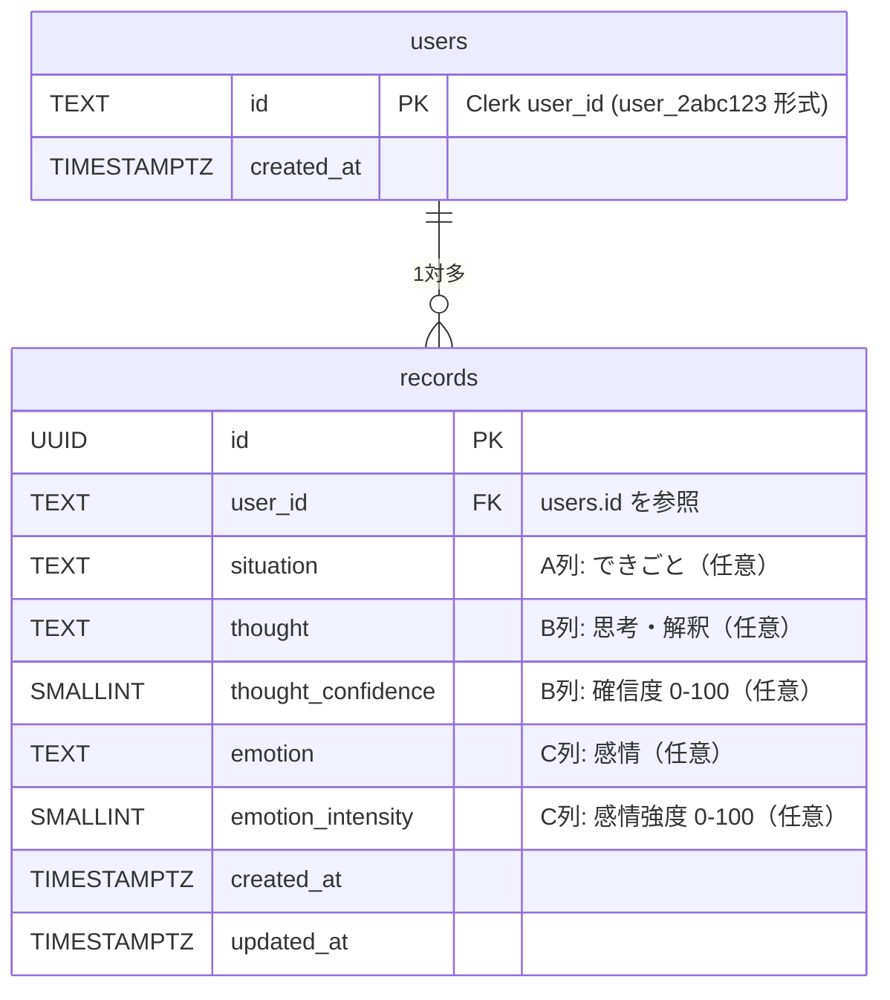

# データベース設計

> 認証・RLS の連携方式は [05_architecture.md](./05_architecture.md) を参照。

---

## 設計方針

| 項目 | 方針 |
|------|------|
| DB エンジン | Supabase PostgreSQL |
| 認証連携 | Clerk Third-party Auth（JWT 検証） |
| `user_id` 型 | **TEXT**（Clerk ID は `user_2abc123` 形式で UUID でない） |
| RLS | 全テーブルに有効化。`auth.jwt()->>'sub'` でユーザー照合 |
| タイムゾーン | `TIMESTAMPTZ`（UTC 保存、表示はクライアント側で変換） |

---

## テーブル一覧

| テーブル名 | 役割 |
|-----------|------|
| `users` | ユーザーメタデータ（Clerk userId との紐付け・`records` テーブルの外部キー参照先） |
| `records` | CBT 3コラム法の思考記録 |

---

## ER 図



---

## テーブル定義

### `users` テーブル

ユーザー初回ログイン時に作成する。`records` テーブルの外部キー参照先として機能する。

| カラム名 | 型 | NULL | デフォルト | 説明 |
|---------|-----|------|-----------|------|
| `id` | `TEXT` | NOT NULL | — | Clerk の userId（PK） |
| `created_at` | `TIMESTAMPTZ` | NOT NULL | `now()` | レコード作成日時 |

---

### `records` テーブル

CBT 3コラム法の思考記録本体。A・B・C 列のうち **1つ以上が入力されていれば保存可能**（すべて NULL は不可）。

数値カラム（`thought_confidence`・`emotion_intensity`）はDBレベルでは常に保持する。**表示・入力の有無はUIが制御する**（プログレッシブ開示などの表示方針は UI 要件定義フェーズで検討する）。

| カラム名 | 型 | NULL | デフォルト | 説明 |
|---------|-----|------|-----------|------|
| `id` | `UUID` | NOT NULL | `gen_random_uuid()` | PK |
| `user_id` | `TEXT` | NOT NULL | — | `users.id` への外部キー |
| `situation` | `TEXT` | NULL | `NULL` | A列: できごと |
| `thought` | `TEXT` | NULL | `NULL` | B列: 思考・解釈 |
| `thought_confidence` | `SMALLINT` | NULL | `NULL` | B列: 自動思考の確信度（0–100） |
| `emotion` | `TEXT` | NULL | `NULL` | C列: 感情 |
| `emotion_intensity` | `SMALLINT` | NULL | `NULL` | C列: 感情の強度（0–100） |
| `created_at` | `TIMESTAMPTZ` | NOT NULL | `now()` | 作成日時 |
| `updated_at` | `TIMESTAMPTZ` | NOT NULL | `now()` | 更新日時 |

**制約**

```sql
-- 少なくとも1コラム入力済みであることを保証する
CONSTRAINT records_at_least_one_column_check
  CHECK (
    situation IS NOT NULL OR
    thought   IS NOT NULL OR
    emotion   IS NOT NULL
  )
```

---

## マイグレーション SQL

```sql
-- =============================================
-- 001: users テーブル
-- =============================================
CREATE TABLE users (
  id         TEXT        PRIMARY KEY,
  created_at TIMESTAMPTZ NOT NULL DEFAULT now()
);

ALTER TABLE users ENABLE ROW LEVEL SECURITY;

-- =============================================
-- 002: records テーブル
-- =============================================
CREATE TABLE records (
  id         UUID        PRIMARY KEY DEFAULT gen_random_uuid(),
  user_id    TEXT        NOT NULL REFERENCES users(id) ON DELETE CASCADE,
  situation          TEXT,
  thought            TEXT,
  thought_confidence SMALLINT CHECK (thought_confidence BETWEEN 0 AND 100),
  emotion            TEXT,
  emotion_intensity  SMALLINT CHECK (emotion_intensity BETWEEN 0 AND 100),
  created_at         TIMESTAMPTZ NOT NULL DEFAULT now(),
  updated_at         TIMESTAMPTZ NOT NULL DEFAULT now(),
  CONSTRAINT records_at_least_one_column_check
    CHECK (
      situation IS NOT NULL OR
      thought   IS NOT NULL OR
      emotion   IS NOT NULL
    )
);

ALTER TABLE records ENABLE ROW LEVEL SECURITY;

-- updated_at 自動更新トリガー
CREATE OR REPLACE FUNCTION update_updated_at()
RETURNS TRIGGER AS $$
BEGIN
  NEW.updated_at = now();
  RETURN NEW;
END;
$$ LANGUAGE plpgsql;

CREATE TRIGGER records_updated_at
  BEFORE UPDATE ON records
  FOR EACH ROW EXECUTE FUNCTION update_updated_at();

-- =============================================
-- 003: インデックス
-- =============================================
-- 一覧取得（ユーザー × 降順）
CREATE INDEX records_user_id_created_at_idx
  ON records (user_id, created_at DESC);
```

---

## RLS ポリシー

> **前提**: Clerk Third-party Auth を使用。`auth.jwt()->>'sub'` で Clerk userId を取得する。`auth.uid()` は使用不可（Clerk ID が UUID 形式でないためキャストエラーになる）。

### `users` テーブル

```sql
-- 自分のレコードのみ参照可能
CREATE POLICY "users_select_own"
ON users FOR SELECT
TO authenticated
USING ((SELECT auth.jwt()->>'sub') = id);

-- 初回ログイン時に自分のレコードのみ作成可能
CREATE POLICY "users_insert_own"
ON users FOR INSERT
TO authenticated
WITH CHECK ((SELECT auth.jwt()->>'sub') = id);

-- 自分のレコードのみ更新可能
CREATE POLICY "users_update_own"
ON users FOR UPDATE
TO authenticated
USING ((SELECT auth.jwt()->>'sub') = id)
WITH CHECK ((SELECT auth.jwt()->>'sub') = id);
```

> **DELETE ポリシーは MVP 対象外**: `users` テーブルの DELETE は、アカウント削除・全データ消去機能（[US-14](../planning/03_use-cases.md)）と合わせて MVP 以降で実装する。

### `records` テーブル

```sql
-- 自分の記録のみ参照可能
CREATE POLICY "records_select_own"
ON records FOR SELECT
TO authenticated
USING ((SELECT auth.jwt()->>'sub') = user_id);

-- 自分の記録のみ作成可能
CREATE POLICY "records_insert_own"
ON records FOR INSERT
TO authenticated
WITH CHECK ((SELECT auth.jwt()->>'sub') = user_id);

-- 自分の記録のみ更新可能
CREATE POLICY "records_update_own"
ON records FOR UPDATE
TO authenticated
USING ((SELECT auth.jwt()->>'sub') = user_id)
WITH CHECK ((SELECT auth.jwt()->>'sub') = user_id);

-- 自分の記録のみ削除可能
CREATE POLICY "records_delete_own"
ON records FOR DELETE
TO authenticated
USING ((SELECT auth.jwt()->>'sub') = user_id);
```

> **パフォーマンス最適化**: `auth.jwt()->>'sub'` をサブクエリ `(SELECT auth.jwt()->>'sub')` でラップする。これにより Postgres がプランニング時に1回だけ評価し、行ごとに再評価しない。

---


## テーブル設計の決定記録

### `records` テーブルの単一テーブル方針（STI）

**決定**: 5コラム法・7コラム法を将来追加する場合も、`records` テーブル1本を維持し、`ALTER TABLE ADD COLUMN` で段階的にカラムを追加する（Single Table Inheritance 方式）。

**検討した代替案**

| パターン | 概要 | 採用しない理由 |
|---------|------|--------------|
| CTI（Class Table Inheritance） | 共通カラムを親テーブル、固有カラムをサブテーブルに分離 | 一覧・インサイト取得のたびに LEFT JOIN が必要。Supabase JS client の型生成と相性が悪く、RLS ポリシーを複数テーブルに管理する負荷が高い |
| Concrete Table Inheritance | コラム法ごとに独立したテーブル | 「日によってコラム法を使い分ける」要件がある時点で一覧表示に UNION ALL が必須となり、クエリが複雑化する |
| EAV（Entity-Attribute-Value） | 属性名・値を行で表現 | DB レベルのCHECK制約が機能しない。クエリが複雑で Supabase JS client と相性が悪い |
| PostgreSQL INHERITS | PostgreSQL 固有のテーブル継承 | 外部キー制約・RLS・Supabase 型生成のいずれも正常に機能しない |

**STI を採用する根拠**

- PostgreSQL の NULL カラムはデータ領域を消費しない（NULL bitmap のオーバーヘッドは最小限）。7コラム法まで追加しても15カラム未満であり、スパースカラムの実害が生じる閾値（20〜30カラム）に達しない
- `ALTER TABLE ADD COLUMN`（デフォルト NULL）はほぼ即時完了。ダウンタイムゼロでマイグレーション可能
- 1テーブルのまま Supabase JS client を使えるため、`database.types.ts` の型生成・RLS ポリシー管理がシンプルに保てる
- 一覧・インサイト機能で全コラム法のレコードを JOIN なしで横断参照できる

**段階的拡張プラン**

```
Phase 1（MVP 現在）:  records テーブル 9カラム → そのまま
Phase 2（5コラム法）: column_type, balanced_thought を ALTER ADD → 11カラム
Phase 3（7コラム法）: distortion_type, behavior_change 等を ALTER ADD → 13〜15カラム
```

**5・7コラム法の UX 設計時の注意事項**

コラム法を追加する際は DB マイグレーションの前に **UX 設計の検討が必須**。以下の点が未確定であり、UI の方針によって DB スキーマ（特に `column_type` カラムの要否）が変わる。

- ユーザーが「3コラム法」「5コラム法」をフォームで**明示的に選択する**設計か、入力フィールド数に応じて**暗黙的に判定する**設計か
- 一覧画面でコラム法別にフィルタリングする機能が必要か

これらは実装方法や使い勝手によって正解が変わる。**動くプロトタイプを複数用意して比較検討し、UX を確定してから DB マイグレーションを実施する**。

---

## 将来拡張の考慮

MVP 以降で追加が想定されるテーブル・カラムを事前に把握しておく。実装は行わない。

| 機能 | 追加内容 |
|------|--------|
| B列ラベル比較 | `users` に `ab_variant TEXT` カラムを追加。MVP 以降でラベル表現（「どう捉えたか」vs 他候補）の効果を比較する場合に使用 |
| 5コラム法 | `records` に `column_type SMALLINT`、`balanced_thought TEXT` カラムを追加（詳細は上記「テーブル設計の決定記録」参照） |
| タグ | `tags` テーブル + `record_tags` 中間テーブル |
| 認知の歪みラベル | `records` に `distortion_type TEXT[]` カラムを追加 |
| AI サジェスト | `ai_suggestions` テーブル（`record_id` FK） |

---

## インデックス設計

| インデックス名 | テーブル | カラム | 目的・対応クエリ |
|-------------|---------|-------|----------------|
| `records_user_id_created_at_idx` | `records` | `(user_id, created_at DESC)` | 一覧取得（`WHERE user_id = ? ORDER BY created_at DESC LIMIT 20`）。`user_id` の等値フィルタと `created_at` の降順ソートを1インデックスでカバーする。RLS ポリシーの USING 句も `user_id` を参照するため、フルスキャン回避にも機能する |

### インデックス追加の判断基準

- **追加しない条件**: 行数が 1,000 未満の場合はフルスキャンの方が速いことがある
- **追加する条件**: WHERE / ORDER BY / JOIN ON に頻出し、かつ選択性（カーディナリティ）が高いカラム
- **上限目安**: 1テーブルあたり 10 インデックスを超えたら見直しを検討（書き込みオーバーヘッドが増加する）

> **RLS との関係**: RLS の USING 句はクエリの WHERE 句として評価される。`user_id` を条件とするすべてのテーブルに `user_id` を含むインデックスが必要。

---

## 接続設定

### Supavisor（接続プーラー）

Supabase は PgBouncer に代わる自社製プーラー「Supavisor」を標準提供する。

| 接続モード | ポート | 用途 | 本プロジェクトでの使用 |
|-----------|-------|------|------------------|
| Transaction Mode | 6543 | サーバーレス・短命コネクション | **使用**（Next.js Server Actions / Vercel Functions） |
| Session Mode | 5432 | 永続コネクション・prepared statement | 使用しない |
| Direct Connection | 5432 | マイグレーション実行時 | `supabase db push` 実行時のみ |

> Transaction Mode では prepared statements が使用不可。Supabase JS client（PostgREST 経由）は prepared statements を使わないため問題なし。

### Free Tier のリソース制限

| リソース | 上限 | 対応方針 |
|---------|------|---------|
| データベースサイズ | 500 MB | 超過で読み取り専用モードに移行。MAU × 想定レコード数で定期的に試算する |
| ストレージ | 1 GB | MVP では Storage 未使用のため問題なし |
| プロジェクト数 | 2（Free プラン） | 本番・開発で2プロジェクト使用 |
| 自動バックアップ | なし | 下記「バックアップ方針」を参照 |

---

## バックアップ方針

### Free Tier の制約

Supabase Free Plan には自動バックアップが存在しない（Pro Plan: 7日間保持、PITR は有料アドオン）。

### 手動バックアップ手順

```bash
# Supabase CLI でローカルにダンプ
supabase db dump --project-ref <PROJECT_REF> > backup_$(date +%Y%m%d).sql

# または pg_dump 直接（Direct Connection URL を使用）
pg_dump "postgresql://postgres:[PASSWORD]@[HOST]:5432/postgres" \
  --schema=public \
  --no-owner \
  > backup_$(date +%Y%m%d).sql
```

### スケールアップ判断基準

データベースサイズが **200 MB を超えた時点**で Pro Plan（$25/月）へのアップグレードを検討する。Pro Plan で自動バックアップ（7日保持）が有効になる。

### スキーマの永続性

`supabase/migrations/` ディレクトリにすべてのマイグレーション SQL を保管することで、データが失われてもスキーマは Git から再現可能。

---

## マイグレーション方針

### Supabase CLI を使ったマイグレーション管理

```bash
# 新しいマイグレーションファイルを作成
supabase migration new <migration_name>
# → supabase/migrations/<timestamp>_<migration_name>.sql が生成される

# リモートに未適用マイグレーションを push
supabase db push

# TypeScript 型を再生成（スキーマ変更後は必ず実行）
npx supabase gen types typescript --project-id "$PROJECT_REF" \
  > src/types/database.types.ts
```

### ファイル命名規則

```
supabase/migrations/
├── 20260201000000_create_users.sql
├── 20260201000001_create_records.sql
└── 20260301000000_add_column_type_to_records.sql  # 将来の例
```

`<timestamp>_<説明的な名前>.sql` の形式で、何を変更したかがファイル名から分かるようにする。

### ゼロダウンタイムの原則

| 操作 | 安全か | 備考 |
|------|-------|------|
| `ALTER TABLE ADD COLUMN`（NULL 許可） | **安全**（即時完了） | — |
| `CREATE INDEX CONCURRENTLY` | **安全**（ロックなし） | `CREATE INDEX`（ロックあり）は本番 NG |
| `ALTER TABLE ADD COLUMN NOT NULL`（既存行あり） | **危険** | ① NULL 許可で追加 → ② バックフィル → ③ NOT NULL に変更の3段階で実施 |
| `ALTER TABLE RENAME COLUMN` | **危険** | 旧カラム残存 → 新カラム追加 → データコピー → 旧カラム削除の順で実施 |
| `DROP TABLE` / `DROP COLUMN` | **危険** | アプリコードから参照を除去してから実施 |

### ロールバック方針

Supabase CLI はロールバックコマンドを提供しない。**前進的（forward-only）マイグレーション**を採用する。誤ったマイグレーションは「元に戻す変更を加えた新しいマイグレーション」として追加する。

---

## MVP 後に追記予定の項目

ユーザー数・データ量が増加した段階で以下の内容を追記する。

| 項目 | 追記するタイミングの目安 |
|------|----------------------|
| クエリパターン一覧（画面ごとのクエリとインデックス対応表） | 画面実装完了後 |
| データライフサイクル・削除方針（物理削除の根拠・PII の取り扱い） | ユーザー公開前 |
